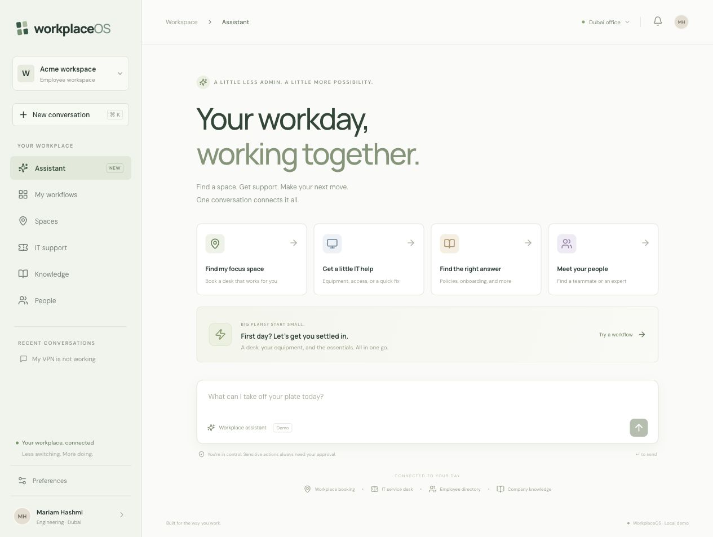
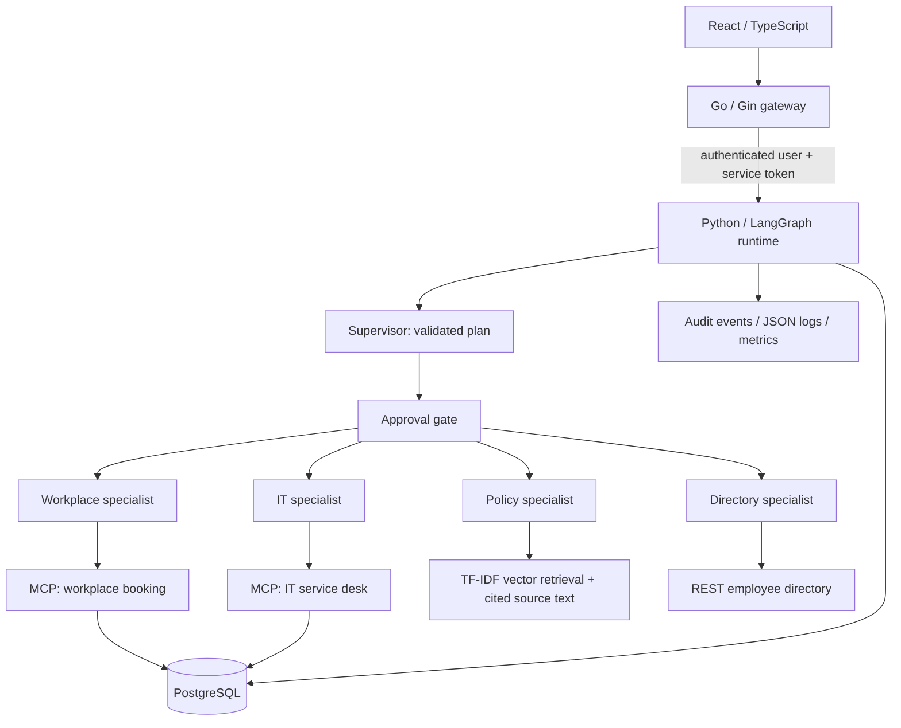

# WorkplaceOS

**An enterprise-services agent that turns one employee request into an auditable workflow across workplace booking, IT support, employee information, and company policies.**

React + TypeScript · Go + Gin · Python + LangGraph · MCP · PostgreSQL



## Start locally

Requires Python 3.11+, Go 1.23+, and Node 22+.

```sh
make install
make dev
```

Open **http://localhost:5173**. The local demo login code is `workplace-demo`. Logs and the SQLite development database live under `.run/`. Stop all services with Ctrl-C in the terminal running `make dev`.

No model key is required. The default **demo-rules** planner supports the documented workplace intents and deliberately asks for clarification outside that range. It is not an LLM. The actual application still executes a LangGraph workflow and discovers/calls both MCP servers over HTTP.

### Docker Compose / PostgreSQL

```sh
cp .env.example .env
make compose
# Stop containers without deleting data:
docker compose --env-file .env -f infra/docker-compose.yml down
```

The browser address is the same. Compose uses persistent PostgreSQL, an initialization job, two MCP services, the directory service, runtime, gateway, web server, and a retention worker. Only the web port is published, on loopback. Redis is intentionally omitted: this demo needs durable workflow state, not a second state store.

### Use an LLM

Set `PLANNER_MODE=llm` plus `LLM_BASE_URL`, `LLM_MODEL`, and `LLM_API_KEY`. The base URL should include the provider API version prefix (for example `/v1`); the adapter appends `/chat/completions`. It expects a Chat Completions compatible endpoint supporting JSON-object output. Optionally set the three `FALLBACK_LLM_*` variables. Compose reads `.env`; for `make dev`, export the variables in your shell first. Never commit keys.

Remote output is validated as a Pydantic plan, checked against specialist allowlists and dependency rules, and validated again against discovered tool schemas. A malformed or unavailable primary provider falls back to the configured secondary provider. If both fail, no tool is executed. The demo planner is never a silent fallback from an LLM. Provider adapters have mocked tests; a paid/live model is not required by or represented in the checked-in evaluation results.

## Try these workflows

- “I start Monday in Dubai. Book me a desk near Engineering, check onboarding requirements, and create an IT ticket for a monitor.”
- “Book a meeting room in Dubai tomorrow for 6 from 10:00 to 11:00.”
- “Request Dubai floor 3 access for onboarding.” Review and approve or reject the exact action in the UI.
- “What is the desk and meeting room booking policy?”
- “Find the Engineering team.”
- “Check ticket create-…” or “Cancel reservation reserve-…” using IDs from a completed workflow.
- “Book a desk” → “tomorrow” in the same conversation.

The UI includes the assistant, workflow history, space booking, ticket status, policy search, employee search, explicit preferences, and an audit drawer. These use the application API; there are no fabricated dashboard metrics.

## Architecture



**Go** owns the HTTP boundary: signed sessions, origin checks, rate limiting, validation, identity forwarding, and request logs. **Python** owns typed plans, the graph, provider adapters, retrieval, and MCP integration. The runtime is private; callers cannot choose their identity through request content.

**LangGraph** makes supervisor → approval → specialist → approval → evaluator transitions explicit. The application stores durable state after each node/step, including the cursor, successful outputs, approved step IDs, errors, and final response. Approvals resume the stored plan instead of asking a model to reproduce it. This uses application-level checkpoints, not a LangGraph checkpoint saver; that choice is documented in [architecture](docs/architecture.md).

**MCP** decouples protocol discovery and invocation from concrete booking/ticket adapters. The runtime calls `initialize`, `tools/list`, and `tools/call` with the official SDK. Both servers are separate processes and generate JSON Schemas from typed Python functions. See [tool schemas and protocol design](docs/mcp.md).

**Delegation** is deliberately bounded: the supervisor produces one plan; scoped specialists execute allowed capabilities inside one graph. They do not create recursive agents or spend additional model tokens on straightforward tool calls. This is a supervisor/specialist design, not four autonomous LLM conversations.

## Memory, privacy, and approvals

- Working memory holds the plan, outputs, cursor, dependency references, and unresolved task context.
- Recent context is limited to five workflows from the same employee and conversation. Workflow bodies expire after seven days via the retention worker.
- Only explicitly saved building/desk-zone preferences become persistent memory. They expire after 90 days and can be forgotten in the UI.
- Transaction records (tickets, reservations, access submissions) remain in their simulator system of record. They are distinct from conversational memory. The demo does not implement corporate record-retention rules.
- Reads and desk/room bookings execute automatically. Access submissions, cancellations, and ticket updates require approval of each step.
- Approval decisions include actor, timestamp, workflow ID, and step ID. Approval updates use a database compare-and-swap to reject duplicate or cross-user decisions.
- An access request is only **submitted**. It never grants physical access; Facilities approval is a separate business process.

See [security and retention](docs/security.md) for trust boundaries and deployment limits.

## Reliability

Tool calls have an eight-second timeout and at most three attempts with exponential backoff. Schema/business errors are not retried. Three downstream failures open a 20-second circuit per service. A failed dependency is skipped; independent steps continue, and the result is explicitly marked partial.

Writes use a stable workflow/step idempotency key. The simulator stores the operation receipt and business record in one transaction. Retrying after a lost response returns the original result. Booking conflict checks and writes share a transactional lock. Client request IDs also deduplicate workflow submissions.

“Retry unfinished steps” resumes the stored plan, preserving successful actions. Stale running workflows can be resumed through the API after five minutes. Approval decisions remain valid only for the corresponding stored steps. Read [failure recovery](docs/failure-recovery.md) for reproducible outage tests.

## Evaluation and tests

```sh
make test
make eval
make build
# With the local stack running:
.venv/bin/python scripts/smoke.py
```

The checked-in evaluation dataset contains **45 reproducible scenarios** spanning booking, IT, policies, directory, clarification, approval, rejection, and injected failures. `evals/results.json` contains every case result and aggregate metrics from an actual run. These are **deterministic demo-planner tests against an in-process tool adapter**, not evidence of general LLM performance, live MCP latency, or production scalability.

The 45-case run passed 45/45, with exact tool selection and checked arguments passing all cases, and no unnecessary tools relative to fixture expectations. Zero model tokens/cost reflects the no-model mode. See [evaluation methodology](docs/evaluation.md) for denominators, the intentionally simple single-tool baseline, and limitations. Never use these numbers as a live-model accuracy claim.

Separate tests exercise real HTTP MCP transport, gateway authentication and identity forwarding, malformed model output, fallback, approval persistence, ownership, retries, conflict handling, and response-loss idempotency. CI runs the Python/Go tests, evaluation, frontend build, and real-protocol smoke test.

## Repository

```text
frontend/                  React application
 gateway-go/               HTTP/session boundary (Go + Gin)
 agent-python/app/
   graph/                  Explicit workflow and durable resume
   agents/                 Supervisor provider + scoped specialists
   tools/                  MCP router, policy index, simulator domain
   memory/                 PostgreSQL/SQLite persistence
   evaluation/             Reproducible harness and test-only adapter
 mcp/workplace-booking/     Booking MCP server
 mcp/it-service/            Ticket MCP server
 policy-data/              Fictional, versioned company policies
 evals/                    Scenarios and measured results
 infra/                    Containers, Compose, Nginx
 scripts/                  Development, retention, smoke testing
 docs/                     Design, security, demos, decisions
```

## Portfolio and trade-offs

[Demo script](docs/demo.md) · [Architecture](docs/architecture.md) · [Decisions](docs/decisions/001-scope.md) · [Validation record](docs/validation.md)

This is a runnable portfolio application with realistic **local simulators**, not a connection to a real employer's systems. Demo sign-in uses a shared code and a fixed employee. Before public deployment, replace it with OIDC/SSO, introduce organizational permissions, authenticated MCP service identities, production secrets management, migrations, durable job dispatch, and tenant isolation. The single-process rate limiter/circuit breakers and globally serialized simulator writes are explicit scaling trade-offs. Semantic embeddings, Redis, external tracing, and cloud deployment remain extensions rather than hidden dependencies.

Resume bullets grounded in the implementation:

- Built a workplace-services platform using Go, Python, LangGraph, and React to execute multi-step employee workflows.
- Integrated booking and IT service capabilities through two MCP servers with schema validation, retries, idempotency, and auditable execution.
- Implemented durable workflow state, scoped specialist delegation, persistent preferences, and human approval gates.
- Created a reproducible scenario harness measuring tool selection, argument checks, policy retrieval, latency, approval compliance, and failure handling.

## References

Graph construction follows the [LangGraph StateGraph API](https://reference.langchain.com/python/langgraph/graph/state/StateGraph). MCP clients and servers use the [official MCP Python SDK](https://github.com/modelcontextprotocol/python-sdk/tree/v1.x). Dependencies are locked to the versions used by this repository.
