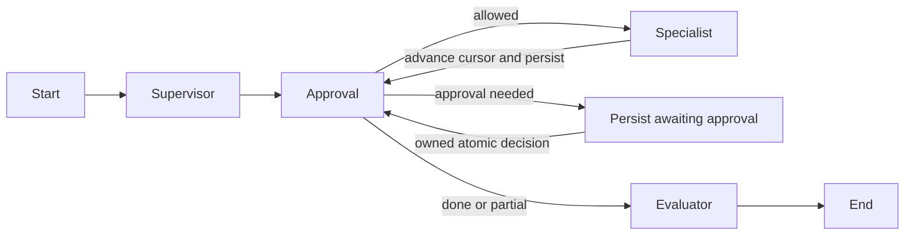

# Architecture and runtime contracts

## Service boundary

The gateway is the sole browser API. Nginx/Vite forwards `/api` to Go. Go authenticates the signed, HttpOnly, SameSite=Strict session cookie, rate limits requests, checks mutation origins, validates message size, strips cookies/authorization, and overwrites internal identity headers. FastAPI requires a service token and an employee ID. MCP services and the directory are internal dependencies.

The Go and Python processes share no code. Their contract is HTTP JSON; `app.main` generates OpenAPI at `/openapi.json`. In local development the services listen on 5173 (web), 8080 (gateway), 8000 (runtime), 8001/8002 (MCP), and 8003 (directory). Only the web port is exposed by Compose.

## State machine

`AgentState` contains the authenticated employee, conversation ID, original request, typed plan, tool selection, results, working context, explicit preferences, approval state, approved step indexes, cursor, errors, response, provider usage, and timestamps. Every state update is persisted to the `records` table. JSONB is used on PostgreSQL, JSON on SQLite.

Plans have at most 12 steps. Dependencies must point backward. `$0.0.id` means “ID of the first item in step zero's successful result.” Every reference must be declared as a dependency. A room reservation must depend on a search. The server injects user identity and operation keys, never the model. The specialist allowlist, dynamic JSON Schema validation, and domain ownership checks form successive boundaries.

## Checkpoint and crash semantics

This implementation uses LangGraph for graph execution and application-level state snapshots for durable resume. It does not claim to use a LangGraph checkpointer. At a pause, the graph returns a persisted `awaiting_approval` state. Approval atomically claims that state, records the decision, adds the approved index, and starts the graph at the gate. Repeated clicks lose the compare-and-swap and receive 409.

A client supplies a request ID. The server derives a user-scoped workflow ID and inserts it once. Duplicate submissions return that workflow; reusing the key for a different message returns 409. A successful business mutation and its idempotency receipt commit together. A crash between mutation and state-save is recovered by invoking the same step with the same key.

The retry endpoint accepts failed/partial states, or a running state idle for five minutes. It retains successful results and approvals, clears failed results, and re-executes only missing steps from the original plan. It does not make a second reservation when retrying an unrelated ticket. Five minutes is longer than this bounded 12-step runtime's expected per-node timeout envelope; a production worker/lease system should replace manual recovery at scale.

## Retrieval and generation

The small policy corpus is indexed with deterministic TF-IDF vectors and cosine similarity. There is no external embedding dependency. Matching policy excerpts and filenames are returned by `search_policy`; synthesis quotes stored source text rather than asking a model to invent an answer. Documents contain owners and review dates. Retrieval returns no result when no terms match. This is a lightweight retrieval-and-grounded-answer implementation; it is not semantic search.

## Persistence and migrations

One schemaless document table keeps this portfolio code compact. Indexed kind/owner columns support filtering. `create_all` is run by an initialization job before dependent containers start. This is initial schema creation, not a versioned migration system. Future schema changes should introduce Alembic and typed business tables. The simulator's database lock row serializes mutations, including availability checks, across booking and IT workers. This favors correctness over throughput.

## Observability

Gateway logs contain request ID, method, route, status, and duration. Runtime completion logs are JSON with workflow ID/status/duration; detailed events are persisted in the audit store. Tool completion events include attempt and timing. `/api/audit` is ownership-scoped. `/api/metrics` exposes process-local run/failure counts and accumulated latency in Prometheus text format. These counters reset on process restart. Audit events form a workflow trace; an OpenTelemetry collector and trace propagation are not included.
